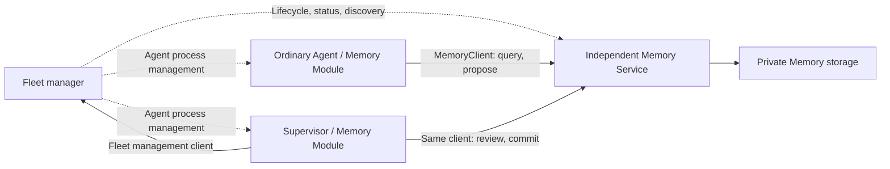

# Fleet Service Management and Access Proposal

> English | [中文](fleet-service-management.zh.md)

Status: lifecycle/discovery foundation and Memory/Supervisor integration implemented. Updated: 2026-09-18.

The implemented configuration, commands, locks and restart budget are defined by
[Independent Fleet Services](../../internal/fleet/services/README.md), code and
tests. Configuration below illustrates the independent-service boundary.

This proposal defines process management, discovery, and client access for independent services. [Supervisor](supervisor-agent.md) and [Memory](fleet-memory.md) build on it and own their execution-role and memory-business designs respectively.

## Architecture and Scope

One user owns one Fleet, the logical owner of Agents, services, and shared resources. A machine may run several Fleets. The Fleet manager, each Agent (including Supervisor), and Memory Service run in separate processes. Fleet ownership does not require resources to live inside the Fleet management process.

Do not implement a Fleet Module Host, a centralized `juex shared services` business process, or a Fleet Server/Client that proxies every business request. Existing Agent Modules retain their in-process lifecycle. Features needing shared capabilities access independent services through their own typed clients. Future A2A and collaboration services follow the same management and discovery conventions.



Initially, each Fleet has one Memory Service instance by default. Independent services define deployment boundaries; they do not require cross-machine scheduling, multi-tenant services, horizontal replicas, or a service mesh now.

## Responsibilities and Interfaces

| Component | Responsibility |
| --- | --- |
| Fleet management | Service definitions, managed process start/stop/restart, status and log access, endpoint publication/discovery, existing Agent management. |
| Independent business service | Its listener, business validation, storage, jobs, receipts, concurrent commits, and recovery. |
| Typed service client | One service's operations, deadlines, cancellation, connection state, and reconnection as needed. |
| Agent Feature Module | Tools, necessary guidance, context, and execution policies through injected narrow client interfaces. |
| Protocol adapter | Expose the same service operations through internal RPC or optional MCP interfaces. |

Service management handles only processes and runtime descriptions; discovery resolves `(fleet_id, service_id)` to endpoints. Clients do not import server implementations, and Features do not locate other Modules by string. `internal/app` explicitly composes and injects dependencies.

Reuse the RPC framework, connection configuration, discovery format, and error conventions. Do not require one listener, one connection, or a generic `invoke(module, operation)` for every service. Business queues, idempotency records, result reconciliation, and deletion rules belong to each service, without a universal job engine or cross-service transactions.

## Service Definitions and Configuration

Support two ownership modes: `managed` processes are started and managed by Fleet; `external` services supply configured endpoints and are deployed elsewhere. Fleet must not stop or take over external processes.

Illustrative configuration; exact fields remain subject to implementation review:

```yaml
fleet:
  services:
    memory:
      mode: managed
      enabled: true
      config:
        strategy: basic

modules:
  memory:
    enabled: true
    service: memory
    profile: agent          # Supervisor uses another capability profile of this Module
```

Only the owning Home configuration defines `fleet.services`; Workspace/Agent layers cannot override it. Existing `modules` still control Agent participation. Each service interprets its own configuration; Fleet does not add every business field to its core configuration structure. External services supply explicit endpoints instead of local launch definitions.

Configuration enablement and desired process state are distinct. A newly enabled managed service initially desires running; explicit stop persists `stopped`, and only explicit start restores `running`. Fleet restarts respect that state instead of immediately undoing a manual stop. Configuration disablement prevents startup and stops the managed instance; incomplete operations are reported, never described as stopped merely because configuration was saved. Disabling external services only stops Juex access, not the remote process.

Initially, restart the affected service to apply service configuration and the affected Agent to apply Agent configuration. Connection loss/recovery alone does not require an Agent restart. Clients cannot treat a service policy snapshot as permanently valid.

## Endpoint Discovery Across Fleets

Locally, retain one Fleet per `JUEX_HOME` and explicitly inject the owning Home and Fleet identity into Agents. Never infer ownership from the current directory, a global default port, or a display name. Ordinary Agents and Supervisor resolve the same service endpoint; capability differences do not require two service processes.

Proposed layout:

```text
$JUEX_HOME/run/services/<service-id>.json   # rebuildable runtime record
$JUEX_HOME/run/sockets/<service-id>.sock    # local RPC socket
$JUEX_HOME/services/<service-id>/           # private persistent service state
```

A runtime record contains Fleet/service identity, a new `instance_id` per launch, protocol/address, and diagnostic process information. Service identity is stable; PID, port, and instance are not. Dynamic TCP ports publish their actual listener address. Overlong Unix socket paths may use short paths under the user's runtime directory, still isolated by Fleet and resolved through the record.

Fleet serializes startup of each service and atomically publishes its runtime record after storage recovery and a readiness handshake. Readiness must match the expected Fleet, service, and instance; clients also verify these identities on every new connection before sending business requests. A record alone is not liveness evidence. Clients re-resolve on connection failure or instance change and reconnect with bounded backoff. A missing target record means unavailable, without fallback to another Fleet or machine-wide searches for a matching name.

Start with a local file resolver. Clients depend only on a narrow resolution interface so explicit remote addresses or a management API resolver can follow later. Inject the Home/bootstrap address first; discovery cannot depend on discovering itself. HTTP MCP adapters receive the resolved URL in client configuration; third-party clients without dynamic discovery use a stable configured address.

Runtime records share only discovery metadata, not business files for Agents to modify. Instance matching prevents accidental misrouting, duplicate starts, and stopping the wrong process; it does not authenticate callers.

## Communication and Roles

Use Go + CloudWeGo Kitex for internal typed RPC: Unix Domain Sockets on the same machine or TCP across machines, with the same business interfaces. Each service owns its IDL and client, such as `MemoryClient`; Fleet management operations use a separate management client. [Kitex direct connection documentation](https://www.cloudwego.io/zh/docs/kitex/tutorials/basic-feature/visit_directly/) covers addresses and Unix socket access.

Juex Memory defaults to a built-in Agent Module plus typed client for tools, guidance, and bounded Turn recall. Add a Streamable HTTP MCP adapter when external Agents need access. A stdio MCP process can be a thin per-Agent bridge to the same business service. The first version need not implement every adapter.

External plugins may directly offer independent HTTP MCP services to multiple Agents without implementing Juex's Go Module API. Keep protocol connection/session state separate from shared business state. MCP does not automatically provide Fleet isolation, shared storage, or job recovery. The [MCP transport specification](https://modelcontextprotocol.io/specification/2025-11-25/basic/transports) defines stdio and Streamable HTTP connections.

Initially assume a trusted local deployment. Client startup configuration selects `profile=agent|supervisor` and supplies caller context such as Fleet/Agent and execution purpose. Model tool arguments cannot switch profiles. The service still checks permitted operations for the profile and validates requests, source scope, revisions, and assignment attempts. Hiding tools is a presentation constraint, not a substitute for service validation.

These parameters configure capabilities; they do not authenticate identity or prevent a custom client from impersonating a role. A shared OS user also provides no promised Shell/filesystem isolation. Full authentication, credentials, and filesystem isolation are deferred. Retain the caller-context interface so trusted identities can later map to capabilities. This limitation does not waive business consistency checks or make complete authentication a prerequisite for the first version.

## Independent Lifecycles and Failures

Fleet startup waits for neither a Supervisor model Turn nor every optional service to succeed. Each service becomes ready after its own storage recovery and can retain pending work while an execution Agent is offline. An Agent Module starts local client resources only; an unreachable remote service is unavailable capability, not an Agent startup failure.

Managed services survive the manager process and do not inherit its cancellation lifetime. On restart, Fleet verifies and re-adopts a matching live instance before deciding to start one. Single-instance ownership and startup locks prevent duplicate launches by competing managers. Startup intent retains instance and probe information to recover a manager crash between process launch and endpoint publication. The service exclusively owns its state directory; uncertain discovery must not force a second writer into existence. Runtime-record cleanup must match the instance; stopping requires checking the actual target, not only a potentially reused PID.

| Situation | Required behavior |
| --- | --- |
| Fleet manager stops/restarts | Agents and services continue; management is unavailable, while discovered direct service connections may continue. |
| Explicit service stop or whole-Fleet shutdown | Stop managed processes within the explicit scope; services settle in-flight operations and durably retain accepted work. External services are not terminated. |
| One service crashes/is unreachable | Its calls fail within a bound; other services and local Agent execution continue. Apply its bounded restart policy. |
| Agent starts first or discovery record is stale | Preserve local functions, report affected tools unavailable, and reconnect with bounded backoff. |
| Agent stops | Close its clients, without stopping shared services or deleting their data. |
| Supervisor is offline | Memory queries continue and accepted updates wait; Fleet does not run inference instead. |

An offline Fleet manager does not guarantee new service startup, automatic recovery, or new endpoint publication. Those management capabilities are separate from availability of running services. Service status distinguishes configuration disablement, starting, ready, degraded, failed, and stopped, with concrete reasons. Successful discovery does not guarantee a business request will succeed.

Calls have deadlines and cancellation. Cancelling a wait does not undo work already durably accepted by the service. Mutations with lost responses may have unknown outcomes; the service provides request identity, idempotency, and status inspection. Clients must not blindly retry non-idempotent operations. Tool catalogs may remain stable while returning unavailable; automatic recall follows Memory's bounded degradation rules.

## Code Boundaries and Delivery

Fleet extends existing process management and runtime descriptions. Service entrypoints/protocol adapters belong in entrypoints, business implementations in the relevant Feature, and composition in App. Extract shared endpoint/lock/client helpers where existing code warrants reuse, without expanding Agent Module Registry scope. Existing `internal/fleet/service` handles OS service registration and must not be mistaken for this business-service manager; exact new package names remain for implementation review.

The first delivery chain is Fleet starting Memory Service, two Agents discovering and connecting to it, Supervisor processing an update through the same client, and another Agent reading the committed result. Deliver service definitions/process management/local discovery with real Memory operations before any generic plugin host, message bus, or distributed registry.

Acceptance covers two Fleets without cross-routing, duplicate startup and stale-record recovery, respecting explicit stop across manager restart, service survival across Fleet restart, offline Agent startup, isolated service failures, reconnecting to a new instance, rejection of ordinary-profile commits, reconciliation after response loss, and external services never being stopped. Follow the repository [verification workflow](../../.agents/skills/juex-localtest/SKILL.md).

The service management implementation now defines configuration/commands, runtime records, short socket paths and restart budgets. Supervisor and Memory business rules belong to their own proposals. Full authentication, remote orchestration, and additional protocol adapters are separate demand-driven deliveries.
