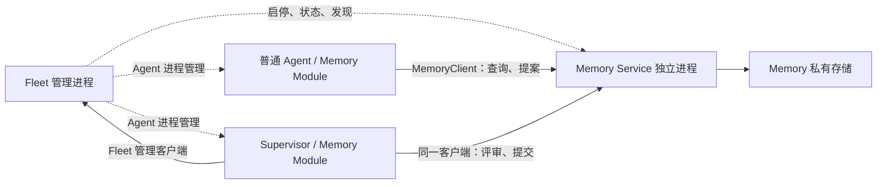

# Fleet 服务管理与接入提案

> [English](fleet-service-management.md) | 中文

状态：评审草案，尚未按本文实现。更新：2026-09-17。

本文定义独立服务的进程管理、发现和客户端接入边界。[Supervisor](supervisor-agent.zh.md) 与 [Memory](fleet-memory.zh.md) 基于本文实现，分别拥有执行角色和记忆业务设计。

## 架构与范围

一个用户对应一个 Fleet，Fleet 是 Agent、服务和共享资源的逻辑归属。一台机器可以运行多个 Fleet。Fleet 管理进程、各 Agent（包括 Supervisor）及 Memory Service 分别运行在独立进程中；共享资源属于 Fleet，不等于必须放在 Fleet 管理进程里。

不实现 Fleet Module Host、集中承载业务的 `juex shared services` 进程，或统一代理所有业务请求的 Fleet Server/Client。现有 Agent Module 保持进程内生命周期；需要共享能力的 Feature 通过自己的类型化客户端访问独立服务。未来 A2A、协作服务沿用同一管理和发现约定。



首版默认每个 Fleet 各有一个 Memory Service 实例。独立服务是部署边界，不要求现在实现跨机器调度、多租户服务、水平副本或服务网格。

## 职责与接口

| 组件 | 职责 |
| --- | --- |
| Fleet 管理 | 服务定义、受管进程启停/重启、状态和日志入口、endpoint 发布/发现；现有 Agent 管理。 |
| 独立业务服务 | 自己的监听入口、业务校验、存储、任务、回执、并发提交和恢复。 |
| 类型化服务客户端 | 一个服务的操作接口、超时、取消、连接状态和按需重连。 |
| Agent Feature Module | 工具、必要指导、上下文和执行策略；通过注入的窄客户端接口访问服务。 |
| 协议适配器 | 将同一服务操作暴露为内部 RPC 或按需提供的 MCP 接口。 |

服务管理接口只处理进程和运行描述；服务发现接口将 `(fleet_id, service_id)` 解析为 endpoint。客户端不导入服务端实现，Feature 不通过字符串查找其他 Module。`internal/app` 显式组装和注入依赖。

复用 RPC 框架、连接配置、发现格式和错误约定，不强制所有服务复用一个监听器、一条连接或通用 `invoke(module, operation)`。业务队列、幂等记录、结果核对和删除规则归各服务，不引入通用任务引擎或跨服务事务。

## 服务定义与配置

支持两种服务归属方式：`managed` 由 Fleet 启动和管理；`external` 只配置 endpoint，由外部系统部署。Fleet 不能停止或接管 external 进程。

示意配置，具体字段在实施时确认：

```yaml
fleet:
  services:
    memory:
      mode: managed
      enabled: true
      config:
        strategy: basic

modules:
  memory:
    enabled: true
    service: memory
    profile: agent          # supervisor 使用同一模块的另一能力配置
```

`fleet.services` 只由所属 Home 的配置决定，Workspace/Agent 不能覆盖。现有 `modules` 继续控制 Agent 参与。服务自己的配置归服务解释，Fleet 不把每种业务字段加入核心配置结构。外部服务用显式 endpoint 替代本地启动定义。

配置启用与进程期望状态分开：首次启用的受管服务默认期望运行；显式停止持久记录 `stopped`，只有显式启动才恢复 `running`。Fleet 重启尊重此状态，不把人工停止立即恢复成运行。禁用配置阻止启动并停止受管实例；操作未完成时明确报告，不能只保存配置就声称服务已停止。外部服务禁用仅停止 Juex 接入，不宣称远端进程已关闭。

首版服务配置变更通过重启该服务应用，Agent 配置变更通过重启该 Agent 应用。仅连接中断/恢复不要求重启 Agent。客户端不持有永久有效的服务策略快照。

## 多 Fleet 的 endpoint 发现

本地沿用一个 `JUEX_HOME` 对应一个 Fleet 的边界，并显式向 Agent 注入所属 Home 和 Fleet 标识。不能根据当前工作目录、全局默认端口或显示名称猜测归属。普通 Agent 和 Supervisor 解析同一服务 endpoint，能力差异不要求两个服务进程。

建议目录：

```text
$JUEX_HOME/run/services/<service-id>.json   # 可重建运行记录
$JUEX_HOME/run/sockets/<service-id>.sock    # 本地 RPC socket
$JUEX_HOME/services/<service-id>/           # 服务私有持久状态
```

运行记录包含 Fleet/服务标识、每次启动新的 `instance_id`、协议/地址和诊断进程信息。固定的是服务身份，不是 PID、端口或实例。TCP 使用动态端口时发布实际监听地址；Unix socket 路径过长时可在用户运行目录下生成短路径，仍按 Fleet 隔离并通过记录解析。

Fleet 串行化同一服务的启动，待服务完成存储恢复和就绪握手后原子发布运行记录。就绪响应必须匹配目标 Fleet、服务和实例；客户端每次建立新连接也先核对这些标识，再发送业务请求。记录本身不证明存活；客户端连接失败或实例变化时重新解析，以有界退避重连。缺少目标记录时报告不可用，不回退到另一 Fleet 或扫描机器寻找同名服务。

首版使用本地文件 resolver；客户端只依赖窄解析接口，以后可增加显式远端地址或管理 API resolver。发现所需的 Home/引导地址必须先注入，不能要求先发现发现服务。HTTP MCP 接入时将解析后的 URL 写入客户端配置；不支持动态发现的第三方客户端使用稳定配置地址。

运行记录只共享发现元数据，不把服务业务文件交给 Agent 修改。实例核对用于避免误连、重复启动和误停旧进程，不等于调用者身份认证。

## 通信与角色

内部类型化 RPC 采用 Go + CloudWeGo Kitex；同机可通过 Unix Domain Socket，跨机器使用 TCP，业务接口保持一致。具体服务拥有自己的 IDL 和客户端，例如 `MemoryClient`；Fleet 管理操作使用单独的管理客户端。[Kitex 直连文档](https://www.cloudwego.io/zh/docs/kitex/tutorials/basic-feature/visit_directly/)说明了地址和 Unix socket 接入。

Juex Memory 默认采用内置 Agent Module 加类型化客户端，以支持工具、指导及后续 Turn 召回。需要外部 Agent 接入时，再添加 Streamable HTTP MCP 适配；stdio MCP 可以作为每个 Agent 的轻量桥接进程，业务仍由同一个服务处理。不要求首版同时实现全部适配。

外部插件也可直接提供独立的 HTTP MCP 服务供多个 Agent 使用，无需实现 Juex 的 Go Module 接口。协议连接/会话状态与共享业务状态分开；使用 MCP 不会自动提供 Fleet 隔离、共享存储或任务恢复。[MCP 传输规范](https://modelcontextprotocol.io/specification/2025-11-25/basic/transports)定义 stdio 和 Streamable HTTP 的连接形式。

首版按可信本地部署处理身份：客户端启动配置选择 `profile=agent|supervisor`，并传递 Fleet/Agent 和执行用途等调用上下文。模型工具参数不能自行切换 profile；服务端仍检查操作是否允许该 profile，并校验请求、来源范围、版本和分派尝试。隐藏工具只是界面约束，不能替代服务校验。

这些参数是能力配置，不是身份认证，不能阻止自编客户端冒充角色；同一 OS 用户下也不承诺隔离 Shell/文件访问。完整认证、凭据和文件系统隔离后续实现，保留调用上下文接口，届时由可信身份映射能力。此限制不免除业务一致性检查，也不把完整认证作为首版前置工程。

## 独立生命周期与故障

Fleet 管理自身启动不等待 Supervisor 完成模型 Turn，也不要求所有可选服务成功。服务各自完成存储恢复后就绪，执行 Agent 不在线时可保留自己的待处理任务。Agent Module 的启动只初始化本地客户端，远端不可达表现为能力不可用，不导致 Agent 启动失败。

受管服务独立于管理进程存活，不绑定管理进程的取消上下文。Fleet 重启先核对和接管匹配的已运行实例，再决定是否启动；单实例所有权和启动锁防止两个管理者重复启动。启动意图保留实例及探测信息，以恢复“进程已启动、endpoint 尚未发布”期间的管理进程崩溃；服务持有自身状态目录的独占所有权，发现结果不确定时不强行另起写入者。清理运行记录必须匹配实例，停止进程须核对实际目标，不能只依据可能复用的 PID。

| 情况 | 必须行为 |
| --- | --- |
| Fleet 管理进程停止/重启 | Agent 与服务继续；管理入口暂不可用，已发现的直接服务连接可继续使用。 |
| 显式停止服务或关闭整个 Fleet | 按明确范围停止受管进程；服务结算在途操作并持久保留已接收工作，external 不被终止。 |
| 单服务崩溃/不可达 | 该服务调用有界失败，其他服务和 Agent 本地执行继续；按该服务策略有限重启。 |
| Agent 先启动或发现记录失效 | 保持本地功能，相关工具报告不可用，后台有界重连。 |
| Agent 停止 | 关闭自己的客户端，不关闭共享服务或删除其数据。 |
| Supervisor 离线 | Memory 查询继续，已接收更新等待执行；不要求 Fleet 代跑模型。 |

Fleet 管理离线期间不保证新服务启动、自动拉起或新地址发布；它与已运行服务的数据通路可用性是两件事。服务状态区分配置禁用、启动中、就绪、降级、失败和已停止，并保留具体原因。发现成功不代表某项业务请求一定成功。

请求有期限和取消；取消等待不撤销服务已持久接收的工作。响应丢失后的变更可能结果未知，由服务提供请求身份、幂等和状态查询，客户端不能盲目重试非幂等操作。工具目录可保持稳定并返回不可用；自动召回按 Memory 的有界降级规则处理。

## 代码边界与交付

Fleet 扩展现有进程管理和运行描述能力；服务入口/协议适配放 entrypoints，业务实现归对应 Feature，App 负责组装。通用 endpoint/锁/客户端辅助仅在已有代码可复用时提取，不扩大 Agent Module Registry 的作用域。现有 `internal/fleet/service` 用于 OS 服务注册，不能直接把它当成本文的业务服务管理器；具体新包名在实施时确定。

第一条交付链是 Fleet 启动 Memory Service、两个 Agent 发现并连接它、Supervisor 经同一客户端处理更新、另一个 Agent 查询已提交结果。先交付服务定义/进程管理/本地发现和 Memory 真实操作，不先建设通用插件宿主、消息总线或分布式注册中心。

验收覆盖两个 Fleet 同机不串联、重复启动和旧记录恢复、显式停止后管理重启不误拉起、Fleet 重启不终止服务、Agent 离线启动、单服务失败、重连到新实例、普通 profile 提交被拒绝、响应丢失后的业务核对，以及 external 服务不被停止。遵循仓库 [验证流程](../../.agents/skills/juex-localtest/SKILL.md)。

待评审的是具体配置/命令、运行记录格式、短 socket 路径规则和重启预算。Supervisor 与 Memory 的业务规则由各自提案定义；完整认证、远端编排和额外协议适配按实际需求另行交付。
