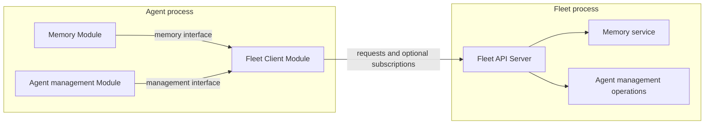

# Fleet Shared Services and Agent Client Proposal

> English | [中文](fleet-shared-services.zh.md)

Status: draft for review; overall direction discussed, details proposed, not implemented. Date: 2026-09-07.

This proposal defines Fleet-owned shared services and their access from Agent Modules. It preserves the current [Module architecture](../adr/0001-lifecycle-driven-module-architecture.md) and [execution contracts](../../DOMAIN.md). Acceptance of this document does not imply implementation completion.

## Problem and Direction

The intended product model is one Fleet per user, containing a default Supervisor Agent and any user-created Agents. Supervisor helps with support, Agent customization, configuration, and eventual optimization based on actual usage. User memory is shared across Agents.

Most resources remain local to an Agent or Thread: Tools, Goal, Notes, Scratchpad, and execution state do not acquire cross-process lifecycles merely because Memory is shared.

The proposed boundary is:

- Fleet runs a server and explicitly assembles the few services that own shared state or fleet-wide operations.
- Each participating Agent uses one Fleet Client Module to manage access to that server.
- Feature Modules receive narrow client interfaces and retain their own tools, context contributions, and policies.
- Supervisor uses the same Agent and Thread execution mechanisms as other Agents, with additional management capabilities.

This change does not introduce remote Module invocation, a distributed Registry, a service locator, a generic message bus, or a Fleet implementation for every Module. It does not require multiple-host deployment or a new account system.

## Ownership

| Owner | Responsibility |
| --- | --- |
| User / Fleet | Agent collection, default Supervisor identity, shared service configuration, and user-owned shared data. |
| Fleet Server | Agent-facing transport, caller identity validation, access checks, request dispatch, and service availability. |
| Shared service | Its business rules, persistent state, concurrency, operation results, and any recoverable background work. |
| Fleet Client Module | Agent-scoped connection resources, request cancellation, connection status, and required subscriptions. |
| Feature Module | Model-facing tools and guidance, context preparation, and feature-specific use of injected client interfaces. |
| Agent / Thread | Existing identity, configuration, execution, history, and local resources. |

The Fleet service process and the Supervisor Agent are distinct. Fleet continues to manage processes and shared services when Supervisor is stopped or cannot call its model. Supervisor owns its conversations; user memory has an independent lifetime.

For the initial local deployment, one `JUEX_HOME` remains the Fleet boundary. Shared storage belongs under that Home, outside individual Agent and Thread directories. Each service defines its own storage layout; this proposal does not create a universal shared-resource schema.

## Composition and Dependencies



Application composition constructs the client and injects its narrow adapters into enabled Feature Modules. Those Modules do not locate another Module by ID, import its private implementation, or obtain the entire Fleet manager. Interfaces stay with their semantic owner or consumer; transport types must not pull server implementations into Agent composition.

The Fleet Client Module owns runtime participation, while an ordinary client library can implement request encoding and transport. Multiple Feature Modules reuse the same client resources within one Agent. The Framework continues to see ordinary Module capabilities and lifecycle methods.

Recommended initial enablement: compose the Fleet Client Module when at least one enabled feature requires Fleet access. Do not add an independent user-facing switch that can leave enabled features without their required client. Disabled consumers create no subscriptions or feature-specific background work.

On the server, Fleet application composition starts and closes explicit service instances. Memory business logic stays with the Memory feature; Fleet hosts it, and HTTP handlers dispatch to its operation interface. Existing lifecycle management stays with Fleet. Neither the server router nor the client becomes a container for all feature logic.

The current package boundaries provide the starting points:

| Current area | Proposed responsibility |
| --- | --- |
| `internal/fleet` | Continue owning Agent registry-wide lifecycle operations; expose them through an injected service interface. |
| `internal/fleetweb` | Adapt the existing server for Agent-facing operations without moving business rules into handlers. |
| `internal/app` | Explicitly assemble Fleet services or Agent client resources at their respective process entry paths. |
| `internal/runtime/module` | Reuse Agent Runtime and Thread capability contracts. |
| Feature implementations | Own Memory and Supervisor management tools and their service adapters. |

Final package paths can follow the separate [repository structure proposal](repository-structure.md). This proposal does not require a repository-wide relocation first.

## Communication Contract

Prefer the existing HTTP/JSON mechanisms for the first implementation. Add SSE or another subscription only when a concrete delivery requirement needs it. Being a client does not require a permanent bidirectional connection. The exact internal endpoint and identity mechanism remain review items.

The contract must establish these boundaries:

1. **Fleet selection and caller identity.** Managed startup supplies or resolves the owning Fleet endpoint and an identity that the server can validate. A caller-supplied Agent ID alone is not authority. Ordinary Agents receive only their permitted shared operations; Supervisor's management access is granted by Fleet. Enabling a client Module does not grant all administrative operations.
2. **Business operations.** Expose operations such as reading memory or updating Agent configuration. Do not expose arbitrary Module methods or another Agent's writable state paths. A shared connection does not make every resource shared.
3. **Results and retries.** A completed read or write returns its result; a submitted background job returns a durable acceptance identity and a way to inspect its outcome. A timeout after a mutation may mean an unknown outcome. Each mutating operation defines idempotency or reconciliation before the client retries it.
4. **Agent communication.** When an operation sends work to another Agent, Fleet resolves the target and uses its existing Input admission and subscription interfaces. References include Agent ID and Thread ID. Acceptance is not completion, and an arbitrary subsequent Assistant message is not a correlated RPC response.

Ordinary request cancellation and deadlines propagate through the transport. Cancelling a wait does not silently cancel an already accepted durable job. Cross-Agent work uses existing Thread execution; Fleet does not gain a second model execution engine.

## Startup, Recovery, and Shutdown

The current CLI waits for Fleet's startup reconciliation before starting the Web server. An Agent that waits for a shared API during startup would therefore introduce a circular dependency. The proposed startup sequence is:

```text
Acquire Fleet ownership
  → recover and prepare enabled shared services
  → publish the internal API as ready
  → ensure the default Supervisor and reconcile managed Agents
  → admit normal service and Agent work
```

Service readiness must not depend on Supervisor completing an LLM Turn. A Memory service can serve committed memory before its maintenance worker becomes available. If a shared service cannot initialize, report its failure explicitly; optional service failure need not prevent unrelated Agent management from working.

Inside an Agent, Fleet client resources use the existing start, activate, quiesce, and close boundaries. Notifications may admit work only after the existing pending-input recovery barrier is established. Composition closes consumers before their client resources. Client activation must not bypass Input admission.

| Event | Proposed behavior |
| --- | --- |
| Agent stops or restarts | Close only that Agent's connections and subscriptions; shared state remains. |
| Fleet becomes unavailable | Fleet-dependent operations report unavailable. Ordinary Agent execution can continue. Automatic recall may proceed without memory while exposing the failure; explicit writes must not report success. |
| Fleet returns | Clients can reconnect; each service resumes its own committed work and processing progress. |
| Fleet shuts down | Stop accepting new shared operations, settle or durably preserve accepted work, then close services. Existing Agent stop policy is unchanged. |
| Feature is disabled on one Agent | Stop that consumer's tools, injection, subscriptions, and new contributions; retain Fleet data. |
| A shared service is disabled | Stop that service's activity and expose its unavailability. Data retention follows the service's explicit contract. |

Optional shared services should not become a blanket prerequisite for Agent health. An Agent launched while Fleet is unavailable may remain usable with the affected capability unavailable; startup diagnostics must make that state visible.

## First Consumers

### Supervisor

Fleet initializes one stable default Supervisor identity using an idempotent bootstrap operation. Current Agent Workspace binding can be satisfied by a system-prepared Workspace. Supervisor's model comes from configured defaults; creating it must not require a working Supervisor conversation.

Supervisor is a normal Agent with support guidance and explicitly granted management tools. It may use separate Threads for customer support, customization, or memory maintenance. Those Thread roles do not create new Engine types.

Configuration changes go through existing Fleet validation, publication, and restart operations. A result distinguishes configuration saved from Runtime successfully applied. Optimization work should retain the proposed change and its observed effect; configuration rollback is not assumed to reverse every stateful side effect.

The product should identify Supervisor by stable identity rather than its editable display name. Its disablement, removal, and recreation policy must be decided before implementing bootstrap.

### Memory

Memory is the first shared-data consumer. It remains one product feature with a server component and an Agent Module component:

- Fleet-side Memory owns shared entries, indexes, concurrency, and any durable maintenance progress.
- Agent-side Memory owns tools, guidance, automatic recall participation, and submission of source material.
- Original dialogue remains Thread-owned. History access uses existing bounded Thread/EventStore operations, with references containing Agent, Thread, Generation, and event sequence.
- A Supervisor Thread can perform maintenance inference; the Memory service owns the job and accepted results. Replacing or deleting that Thread does not delete user memory.

Memory reads do not require a conversation with Supervisor. Maintenance failure must not turn an already completed user Turn into a failed Turn. Feature-owned durable progress and idempotency recover missed or repeated work; in-process notifications alone do not guarantee delivery.

For the shared `basic` / `advanced` strategy, the proposed configuration boundary is: Fleet owns the strategy and service enablement; an Agent controls its participation. A participating Agent cannot override a disabled Fleet service or change the strategy for everyone. Exact YAML paths are left to the Memory specification.

Advanced recall may require a general Turn-preparation contract that supplies the admitted inputs and freezes a bounded recall result. The current `ContextRequest` lacks Turn ID and input content. This is a separate execution requirement to assess during Advanced Memory design, not a reason to make Modules remotely callable.

This proposal supersedes the Agent-owned Memory assumption in the [Module switches draft](module-switches.md) for this design review. Entry formats, LRU rules, graph semantics, extraction thresholds, and forgetting behavior belong to the dedicated Memory specification, not this shared-service foundation.

## Changes to the Existing Architecture

| Area | Decision |
| --- | --- |
| Module Registry and capability model | Keep the existing process-local model and explicit composition. |
| Engine, Input, Turn, Journal, and Thread lifecycle | Preserve current execution and durability rules. Add a narrow lifecycle seam only for a demonstrated feature need. |
| Thread resource ownership ledger | Keep its current purpose; do not extend it to Fleet resources as a prerequisite. |
| Fleet process | Add explicit shared-service startup/recovery/shutdown and correct API readiness ordering. |
| Agent composition | Add Fleet Client Module and inject consumer-specific interfaces. |
| Shared data | Give each service clear ownership and independent retention; reuse storage primitives where appropriate. |

After implementation, update DOMAIN and ARCHITECTURE with the accepted ownership and lifecycle contracts, and consolidate superseded proposal text. They continue to describe current behavior until then.

## Delivery and Verification

Each step should deliver a working vertical slice; this document creates no implementation tasks or delivery commitments.

1. **Fleet access foundation:** expose an existing bounded Agent-inspection operation through an actual Agent Module, with verified caller identity, client lifecycle, server readiness, and unavailable-state behavior.
2. **Supervisor management:** add default identity/bootstrap and management tools, reusing current configuration and Agent lifecycle operations.
3. **Basic shared Memory:** implement the shared store and Agent tools; prove two Agents see the same committed memory and a disconnected or disabled Agent cannot erase it.
4. **Advanced Memory:** add recoverable maintenance hosted by Supervisor Threads and the necessary bounded Turn-recall contract, following the separate Memory specification.

Verification should prove process boundaries and observable behavior: startup does not deadlock; Fleet restart does not terminate an ordinary Agent Turn; an unauthorized Agent cannot obtain Supervisor operations; mutation retries do not duplicate accepted work; Agent or Thread deletion does not delete shared memory; Module disablement stops its participation; failed configuration application is distinguishable from successful publication. Use cross-process E2E coverage as well as focused tests through the repository's [verification workflow](../../.agents/skills/juex-localtest/SKILL.md).

## Review Decisions

The proposed default is one Fleet Server, explicit shared services, and one reusable Fleet Client Module per participating Agent. Before implementation, settle:

1. The Agent-facing endpoint, validated identity mechanism, and relationship to the existing browser API.
2. Supervisor's stable identity record, disable/remove/recreate policy, and initial model configuration.
3. Exact Fleet service configuration versus Agent participation configuration, without changing ordinary Module override rules globally.

Memory algorithms and final package relocation remain separate design work. Universal cross-process Modules are outside this proposal.
