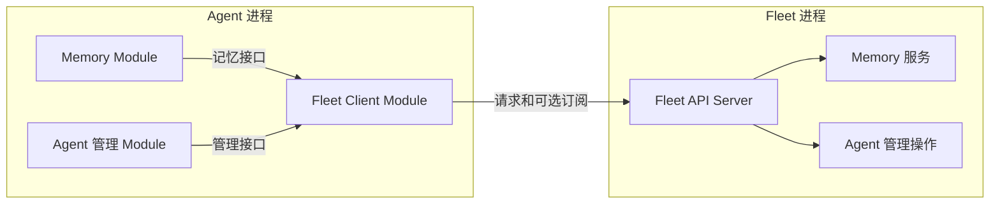

# Fleet 共享服务与 Agent Client 提案

> [English](fleet-shared-services.md) | 中文

状态：评审草案；整体方向已讨论，具体设计待确认，尚未实现。日期：2026-09-07。

本文定义 Fleet 拥有的共享服务及 Agent Module 的访问方式，保留现有 [Module 架构](../adr/0001-lifecycle-driven-module-architecture.zh.md) 和 [执行契约](../../DOMAIN.zh.md)。文档获准不代表实现已经完成。

## 问题与方向

产品预期是一个用户对应一个 Fleet，其中包含默认的 Supervisor Agent 和用户自行创建的 Agent。Supervisor 提供客服、Agent 定制、配置，以及未来基于实际使用情况的优化。用户记忆在多个 Agent 之间共享。

大部分资源仍属于 Agent 或 Thread：Tool、Goal、Notes、Scratchpad 和执行状态，不会因为 Memory 共享就获得跨进程生命周期。

提议采用以下边界：

- Fleet 运行 Server，显式组装少量拥有共享状态或 Fleet 级操作的服务。
- 每个需要访问这些服务的 Agent，通过一个 Fleet Client Module 管理接入。
- Feature Module 接收窄客户端接口，继续拥有自己的工具、上下文贡献和策略。
- Supervisor 沿用普通 Agent 和 Thread 执行机制，获得额外的管理能力。

本次不引入远程 Module 调用、分布式 Registry、服务定位器、通用消息总线，也不要求每个 Module 提供 Fleet 实现。不以多主机部署或新增账户系统为前提。

## 所有权

| 所有者 | 职责 |
| --- | --- |
| 用户 / Fleet | Agent 集合、默认 Supervisor 身份、共享服务配置、用户拥有的共享数据。 |
| Fleet Server | 面向 Agent 的传输入口、调用方身份校验、访问检查、请求分发和服务可用性。 |
| 共享服务 | 自身业务规则、持久状态、并发控制、操作结果，以及必要的可恢复后台工作。 |
| Fleet Client Module | Agent 范围内的连接资源、请求取消、连接状态和必要订阅。 |
| Feature Module | 面向模型的工具和指导、上下文准备，以及通过注入接口使用服务的业务逻辑。 |
| Agent / Thread | 现有身份、配置、执行、历史和本地资源。 |

Fleet 服务进程与 Supervisor Agent 是不同对象。Supervisor 停止或无法调用模型时，Fleet 仍管理进程和共享服务。Supervisor 拥有自己的对话，用户记忆具有独立的生命周期。

首版本地部署继续以一个 `JUEX_HOME` 为 Fleet 边界。共享存储归属该 Home，位于各 Agent 和 Thread 目录之外。每个服务定义自己的存储布局；本文不建立统一共享资源数据模式。

## 组装与依赖



应用组装层创建客户端，将它的窄接口适配器注入已启用的 Feature Module。Feature 不通过 ID 查找另一个 Module、不依赖其私有实现，也不获得完整 Fleet Manager。接口跟随语义所有者或使用者；传输类型不能把服务端实现带入 Agent 的组装依赖。

Fleet Client Module 负责参与运行生命周期，普通客户端库可以实现请求编码和传输。同一个 Agent 中的多个 Feature Module 复用客户端资源。Framework 仍只接触普通 Module 能力和生命周期方法。

首版建议：至少一个已启用 Feature 需要 Fleet 时，才组装 Fleet Client Module。暂不新增可能让已启用 Feature 失去必要客户端的独立用户开关。关闭的使用方不创建订阅或功能后台工作。

服务端由 Fleet 应用组装层启动和关闭明确的服务实例。Memory 业务逻辑留在 Memory Feature，Fleet 承载服务，HTTP Handler 调用其操作接口。现有 Agent 生命周期管理仍归 Fleet。Server 路由和 Client 都不承包所有 Feature 的业务逻辑。

当前包边界提供以下起点：

| 当前区域 | 提议职责 |
| --- | --- |
| `internal/fleet` | 继续拥有注册 Agent 的生命周期操作，通过注入的服务接口暴露。 |
| `internal/fleetweb` | 在现有 Server 基础上接入面向 Agent 的操作，不把业务规则放进 Handler。 |
| `internal/app` | 在相应进程入口显式组装 Fleet 服务或 Agent 客户端资源。 |
| `internal/runtime/module` | 复用 Agent Runtime 和 Thread 的能力契约。 |
| Feature 实现 | 拥有 Memory、Supervisor 管理工具及其服务适配。 |

最终包路径可以跟随独立的 [仓库结构提案](repository-structure.zh.md)。无需先完成全仓库目录迁移才能实现本提案。

## 通信契约

首版优先复用现有 HTTP/JSON 机制。具体交付需求需要通知时，再增加 SSE 或其他订阅方式。Client 身份不要求常驻双向连接。内部端点及身份机制的具体选择仍待评审。

协议需要明确以下边界：

1. **Fleet 选择与调用方身份。** 托管启动提供或解析所属 Fleet 端点，以及服务端能够验证的身份。调用方自行填写 Agent ID 不构成授权。普通 Agent 只获得允许的共享操作，Supervisor 的管理权限由 Fleet 授予。启用 Client Module 不等于获得全部管理操作。
2. **业务操作。** 暴露读取记忆、更新 Agent 配置等操作，不暴露任意 Module 方法或其他 Agent 的可写状态路径。共享连接不改变各资源的所有权。
3. **结果与重试。** 完成的读写返回结果；后台任务提交返回持久接收标识及结果查询方式。变更请求超时可能意味着结果未知；每种变更操作先定义幂等或结果核对方式，再允许客户端重试。
4. **Agent 通信。** 某项操作需要向其他 Agent 发送工作时，由 Fleet 解析目标，使用现有 Input 接纳和订阅接口。引用包含 Agent ID 和 Thread ID。接收不等于完成，随后任意一条 Assistant 消息也不等于对应 RPC 响应。

普通请求的取消和期限通过传输层传递。取消等待不会隐式取消已持久接收的任务。跨 Agent 工作沿用现有 Thread 执行，Fleet 不新增另一套模型执行引擎。

## 启动、恢复与关闭

当前 CLI 等待 Fleet 完成启动协调后才启动 Web Server。如果 Agent 启动时等待共享 API，就会产生循环依赖。建议调整为：

```text
取得 Fleet 所有权
  → 恢复并准备已启用的共享服务
  → 发布已就绪的内部 API
  → 确保默认 Supervisor 存在并协调托管 Agent
  → 接纳正常服务与 Agent 工作
```

服务就绪不依赖 Supervisor 完成 LLM Turn。Memory 服务可以在维护 Worker 可用之前提供已提交记忆。共享服务初始化失败应明确报告；可选服务失败不必阻止无关 Agent 管理功能运行。

Agent 内的 Fleet 客户端资源使用现有 start、activate、quiesce、close 边界。通知只能在现有待处理输入恢复屏障建立后接纳工作。组装顺序保证先关闭使用方，再关闭客户端资源。Client 激活不绕过 Input 接纳流程。

| 事件 | 提议行为 |
| --- | --- |
| Agent 停止或重启 | 只关闭该 Agent 的连接和订阅，共享状态保留。 |
| Fleet 不可用 | 依赖 Fleet 的操作报告不可用，普通 Agent 执行可以继续。自动召回可跳过记忆并暴露失败状态；显式写入不得报告成功。 |
| Fleet 恢复 | Client 可以重新连接；各服务恢复自己的已提交工作和处理进度。 |
| Fleet 关闭 | 停止接收新的共享操作，完成或持久保留已接收工作，再关闭服务。现有 Agent 停止策略不变。 |
| 单个 Agent 关闭 Feature | 停止该使用方的工具、注入、订阅和新贡献，保留 Fleet 数据。 |
| 关闭共享服务 | 停止该服务活动并暴露不可用状态；数据保留遵循服务自己的明确契约。 |

可选共享服务不应成为 Agent 健康的统一前提。Fleet 不可用时启动的 Agent 可以继续提供其他功能，并将受影响能力标为不可用；启动诊断必须能看见该状态。

## 首批使用方

### Supervisor

Fleet 通过幂等初始化操作建立一个身份稳定的默认 Supervisor。当前 Agent 的 Workspace 绑定要求可以由系统准备的 Workspace 满足。Supervisor 使用已配置的默认模型；创建它不依赖一次成功的 Supervisor 对话。

Supervisor 是带有客服指导和明确管理权限的普通 Agent。它可以用不同 Thread 承担客服、定制和记忆整理，这些 Thread 角色不产生新的 Engine 类型。

配置变更经过现有 Fleet 的校验、发布和重启操作。结果区分配置已保存与 Runtime 已成功应用。优化工作应保留提议变更及观察到的效果；不能假定配置回滚能够逆转所有有状态副作用。

产品通过稳定身份识别 Supervisor，不依赖可编辑的显示名称。实现初始化前，需要明确其禁用、删除和重建策略。

### Memory

Memory 是首个共享数据使用方，仍是一个产品 Feature，包含服务端组件和 Agent Module 组件：

- Fleet 侧 Memory 拥有共享条目、索引、并发控制，以及必要的持久维护进度。
- Agent 侧 Memory 拥有工具、指导、自动召回参与和来源材料提交。
- 原始对话继续归 Thread。历史访问使用现有有界 Thread/EventStore 操作，引用包含 Agent、Thread、Generation 和事件序号。
- Supervisor 的一个 Thread 可以执行维护推理；Memory 服务拥有任务和已接收结果。更换或删除该 Thread 不删除用户记忆。

读取记忆不要求先与 Supervisor 对话。维护失败不能把已完成的用户 Turn 改为失败。Feature 自己的持久进度和幂等规则负责补齐遗漏、处理重复工作；仅靠进程内通知不能保证交付。

对于共享的 `basic` / `advanced` 策略，建议配置边界为：Fleet 决定策略和服务启用，Agent 决定自身是否参与。参与的 Agent 不能覆盖 Fleet 的关闭决定，也不能替所有 Agent 切换策略。具体 YAML 路径留给 Memory 规格确定。

Advanced 召回可能需要通用 Turn 准备契约，提供已接纳输入并冻结有界召回结果。当前 `ContextRequest` 没有 Turn ID 和输入内容。这是 Advanced Memory 设计时单独评估的执行需求，不构成让 Module 支持远程调用的理由。

在本次设计评审中，本文替代 [Module 开关草案](module-switches.zh.md) 中 Memory 归 Agent 的假设。条目格式、LRU、图谱语义、提取阈值和遗忘行为属于独立 Memory 规格，不纳入共享服务基础建设。

## 对现有架构的调整

| 区域 | 决策 |
| --- | --- |
| Module Registry 与能力模型 | 保留进程内模型和显式组装。 |
| Engine、Input、Turn、Journal、Thread 生命周期 | 保留现有执行与持久化规则；仅在具体 Feature 确有需要时增加窄生命周期接口。 |
| Thread 资源归属账本 | 保留当前用途，不以前置扩展到 Fleet 资源为条件。 |
| Fleet 进程 | 增加共享服务的显式启动、恢复和关闭，调整 API 就绪顺序。 |
| Agent 组装 | 增加 Fleet Client Module，注入各使用方需要的接口。 |
| 共享数据 | 各服务拥有明确的所有权和独立保留规则，适当复用底层存储机制。 |

实现后，将接受的所有权和生命周期契约更新到 DOMAIN、ARCHITECTURE，并合并或移除被替代的提案内容。在此之前，根文档继续描述当前行为。

## 交付与验证

每一步应交付能够运行的完整功能切片；本文不创建实施任务，也不构成交付承诺。

1. **Fleet 接入基础：** 通过真实 Agent Module 调用现有的有界 Agent 查询操作，落实可验证调用方身份、Client 生命周期、Server 就绪和不可用状态。
2. **Supervisor 管理：** 增加默认身份、初始化和管理工具，复用现有配置及 Agent 生命周期操作。
3. **Basic 共享 Memory：** 实现共享存储和 Agent 工具，验证两个 Agent 看到相同的已提交记忆，断连或禁用 Agent 不会删除记忆。
4. **Advanced Memory：** 按独立 Memory 规格，增加由 Supervisor Thread 执行的可恢复维护及必要的有界 Turn 召回契约。

验证应覆盖进程边界和可观察行为：启动不会互相等待；Fleet 重启不会终止普通 Agent Turn；未授权 Agent 无法获得 Supervisor 操作；变更重试不重复已接收工作；删除 Agent 或 Thread 不删除共享记忆；关闭 Module 会停止自身参与；配置应用失败与配置发布成功能够区分。使用跨进程 E2E 和聚焦测试，遵循仓库 [验证流程](../../.agents/skills/juex-localtest/SKILL.md)。

## 待评审决策

建议基线是一个 Fleet Server、显式共享服务，以及每个参与 Agent 中可复用的一个 Fleet Client Module。实施前需要确定：

1. 面向 Agent 的端点、可验证身份机制，以及与现有浏览器 API 的关系。
2. Supervisor 的稳定身份记录、禁用/删除/重建策略和初始模型配置。
3. Fleet 服务配置与 Agent 参与配置的准确位置，不全局改变普通 Module 的覆盖规则。

Memory 算法和最终包路径迁移继续作为独立设计工作。通用跨进程 Module 不在本提案范围内。
