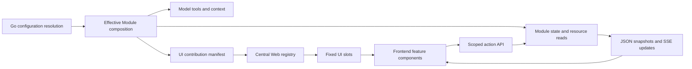

# Module UI Extension Research and JueX Recommendation

> English | [中文](module-ui-research.zh.md)

Research date: 2026-09-06. This document is a proposal for review, not an implemented product contract. Related documents: [Module switches](module-switches.md) and [minimal-mode audit](minimal-mode-audit.md).

Use **Go to determine effective capabilities and UI contributions, with Web composing feature components into fixed slots**. Parse configuration once in Go; Web consumes the composition result without repeating preset defaults or override precedence. Features still have Go and TypeScript implementations, while business state, permissions, and enablement have one authority.

This centralizes composition more effectively than configuration checks across pages and fits the three builtin features better than arbitrary runtime frontend plugins or a Go-authored UI tree. First make Goal, Notes, and Scratchpad complete vertical Modules; decide later whether third-party Extensions need their own UI.

**Comment resolution**

- Recommend `basic-file-tools` for `file-tools` and `file-search` for `search`. Keep existing `kebab-case` Module IDs; configuration fields and tool names retain their own contracts. YAML supports both `_` and `-`, with no syntax advantage here.
- Use one `shell` Module retaining `exec_command`, `write_stdin`, and `list_shell_sessions`. Add no tool and preserve the existing session protocol.
- With the subsequent decision to bring Memory back, the inventory now has 18 switches. Unmodified minimal enables basic-file-tools, shell, and operating-context, exposing 6 model tools.

**Scope and evidence limits**

Local source was inspected and official online documentation opened to cross-check public designs. Source evidence is anchored to the local commits below. No repositories were updated, and no product UI, plugins, or tests were run. Source support is not a claim that every released client implements it.

| Project | Local source commit | Focus |
| --- | --- | --- |
| JueX | `2b0c1bbdc2e55741d680e858e79c635899bf9cf1` | Thread API, frontend projection, Goal/Notes status, Scratchpad panel |
| Codex | `d1d51f6315f84a1737c655cb4d78104d030d5102` | app-server MCP UI negotiation, tool-associated resources, origin binding |
| DeepSeek Harness | `0a53fb55bea101816fa226bb964ae2bed71c343b` | Host/Client composition, Slots, Session projections, Goal UI |
| Pi | `05558a79280a2f1356bd390a573aeb28726d26b5` | TUI extensions, tool-result rendering, RPC UI protocol and limits |

**Implementation comparison**

| Project | UI implementation | Host extension surface | State and communication | Relevance to JueX |
| --- | --- | --- | --- | --- |
| Codex / MCP UI path | Plugin HTML/JS resources displayed by a supporting client | Tool-associated UI resources and MCP Apps capability negotiation; arbitrary application slots are not established | Tool results, resource reads, UI bridge, call-origin binding | Useful for future third-party interactive cards; not a direct replacement for persistent Goal/Notes/Scratchpad panels |
| DeepSeek Harness | React components in browser plugins | Typed, scoped Slots with disposal; Host publishes the actual Client graph | Authoritative Host state → projection/Remote → Client model → UI | Closest fit; borrow contributions and slots without immediately copying the full dynamic loader |
| Pi | Terminal components in TypeScript extensions; RPC clients implement supported displays | Tool/message renderers, widgets, footer/header, custom TUI; RPC covers only a subset | Session extension state, tool details, UI request/response | Useful lightweight UI commands; full TUI components cannot simply execute in a browser |

**Codex: tool-associated resources and client capability negotiation**

The official plugin model packages Skills, MCP tools, and optional UI resources. Its UI guide specifically describes ChatGPT's MCP Apps implementation: `_meta.ui.resourceUri` associates tools with resources; components run inside iframes and communicate through a JSON-RPC bridge over `postMessage`. The backend supplies data and operations, while UI remains HTML/JavaScript, optionally React. The backend language does not directly draw application chrome. See [plugin architecture](https://developers.openai.com/plugins/concepts/plugins) and [UI guide](https://developers.openai.com/plugins/build/chatgpt-ui).

Codex's local app-server source establishes a protocol-support path: clients advertise `io.modelcontextprotocol/ui` and MIME types during initialization, and the Thread session passes that profile downstream to MCP. Tool events carry `appContext.resourceUri`; `mcpServer/resource/read` can use `threadId` and `originCallId` to bind reads to the originating App/account. See [app-server source documentation](https://github.com/openai/codex/blob/d1d51f6315f84a1737c655cb4d78104d030d5102/codex-rs/app-server/README.md#L87) and [origin reconstruction](https://github.com/openai/codex/blob/d1d51f6315f84a1737c655cb4d78104d030d5102/codex-rs/codex-mcp/src/resource_origin.rs#L100).

The official UI reference separates model-visible `content` / `structuredContent` from result `_meta` delivered only to the component. That boundary is useful for minimal mode: presentation data should not automatically become model context. See [tool-result fields](https://developers.openai.com/plugins/reference#tool-results).

The inspected evidence does not establish a public contract for plugins to arbitrarily replace Codex Thread headers, the global sidebar, or the composer. It also does not verify every bridge method in the current desktop client. Treat this as a tool-associated UI protocol, not a promise of complete desktop-layout extensibility.

**DeepSeek Harness: Host graph, browser plugins, projections, and Slots**

This is the closest reference for JueX Web, and it explicitly separates Host business code from Client presentation code.

1. Packages declare `dsh.client` and export a built `./client` entry. Host ClientModuleRegistry scans the Loader, skips disabled entries or entries without a live fiber, builds `window.__DSH_BOOT__`, and serves versioned bundles. The browser starts that graph without reinterpreting Host YAML. See [Client Modules](https://deepseek-harness.github.io/deepseek-harness/en/reference/subsystems/client-modules) and [source filtering](https://github.com/deepseek-ai/deepseek-harness/blob/0a53fb55bea101816fa226bb964ae2bed71c343b/packages/client/modules/src/index.ts#L902).
2. UI plugins register React components with `ctx.slots.register(...)`. Owners declare locations; entries specify identity, order, and scope. Disposal removes contributions and their child declarations. The system supports single/list/keyed/chain cardinalities; JueX need not implement every form initially. See [Slots](https://deepseek-harness.github.io/deepseek-harness/en/reference/subsystems/slots).
3. Pages do not independently reconstruct Session state from logs. Domain Modules register named projections; the framework maintains snapshots over committed events and supplies baselines and updates. Clients receive completed projection values, and UI consumes its key. See [Session projection source documentation](https://github.com/deepseek-ai/deepseek-harness/blob/0a53fb55bea101816fa226bb964ae2bed71c343b/packages/session/session-projection/README.md).
4. Goal demonstrates the full path: the backend registers `goalProjectionDefinition`; frontend `GoalDock` reads `useProjection('goal')`, invokes injected `remote.goals` actions, and registers into `conversation.input.dock`. It owns no separate refresh chain or business-event folder. See [Goal backend](https://github.com/deepseek-ai/deepseek-harness/blob/0a53fb55bea101816fa226bb964ae2bed71c343b/packages/goal/goal/src/index.ts#L254) and [Goal UI registration](https://github.com/deepseek-ai/deepseek-harness/blob/0a53fb55bea101816fa226bb964ae2bed71c343b/packages/client/ui-goal/src/client/index.ts#L81).

The useful principle is a shared composition authority and contract across execution environments. A backend service and a UI package do not automatically guarantee a single whole-feature switch: deployment composition must bind them into one feature. JueX should make that relationship explicit in its Module composition root.

**Pi: flexible in-process TUI, limited cross-process protocol**

Pi extensions can register `renderCall` / `renderResult`, message renderers, status entries, widgets above or below the editor, and `ctx.ui.custom()` terminal components. Components share the Agent's Node process and can use functions, themes, and terminal objects directly. Extensions can also persist private Session state through `appendEntry` without adding dedicated fields to core Session types. See [extension documentation](https://github.com/earendil-works/pi/blob/main/packages/coding-agent/docs/extensions.md).

RPC uses a separate boundary: select/confirm/input/editor become `extension_ui_request` messages answered by matching `extension_ui_response` IDs; notify/setStatus and similar operations are one-way. Source shows `setWidget` transmits string arrays, not component factories; `custom()` returns undefined, and custom footer/header methods are no-ops. See [RPC protocol](https://github.com/earendil-works/pi/blob/main/packages/coding-agent/docs/rpc.md#extension-ui-protocol) and [RPC adapter source](https://github.com/earendil-works/pi/blob/05558a79280a2f1356bd390a573aeb28726d26b5/packages/coding-agent/src/modes/rpc/rpc-mode.ts#L194).

Arbitrary Pi TUI components therefore do not establish an equally flexible remote Web plugin API. Crossing process or language boundaries requires either a bounded declarative component vocabulary or code the client can execute.

**Current JueX coupling**

| Location | Current coupling | Proposed owner |
| --- | --- | --- |
| [Thread response and reads](../../internal/web/handlers.go#L129) | Top-level Goal/Notes fields; inactive-Thread reads construct concrete Stores after checking switches | Generic Thread state envelope; Module-owned read-only contributors |
| [Frontend event projection](../../frontend/src/lib/thread-read-state.ts#L390) | Core reducer recognizes goal.updated / notes.updated and updates dedicated fields | Generic snapshot replacement; Go Modules provide business state |
| [ThreadStatusPanel](../../frontend/src/components/thread/ThreadStatusPanel.tsx#L35) | Always mounts a combined Goal/Notes entry; missing values can still render goal idle | Fixed status slot, separate Goal/Notes contributions, shell-owned layout |
| [AppShell file panel](../../frontend/src/components/AppShell.tsx#L334) | Scratchpad mode, toggle, requests, and refresh revision live in the application shell | File-root registration point; Scratchpad owns its root and loader |
| [Web routes](../../internal/web/server.go#L214) / [file reads](../../internal/web/files.go#L119) | Core dispatches scratchpad subpaths and interprets its root | Module resource adapter; Web owns scope, authorization, and transport |
| [Module contracts](../../internal/runtime/module/registry.go#L20) | Tool/context/policy lifecycles exist, but no complete Web contribution contract | Narrow state/resource and presentation seams; Engine stays independent of HTTP and React |

Passing raw Go configuration into every page leaves these concrete Store, event-name, and layout dependencies intact. Renaming the fields into `map[string]any` while keeping goal/notes switches in Web core would not complete the separation either.

**Recommended minimal structure**



App assembles runtime capabilities and presentation adapters from the same effective Module set. Modules supply displayable state, resources, or actions; presentation adapters supply stable UI IDs. The Web adapter owns HTTP/SSE. Engine knows neither concrete UI nor browser connections. Frontend composition does not reevaluate configuration, and UI data does not automatically enter ContextProvider.

Initially use frontend feature packages built with JueX, such as `frontend/src/modules/goal`, `notes`, and `scratchpad`. Only the composition layer selects imports and registrations from server contributions. Pages render slots without `if (config.modules.goal.enabled)`. Components may handle their own loading, empty, and error states; those are distinct from Module enablement.

Two locations suffice initially: Thread status and optional roots in the file panel. Goal/Notes contribute independently and may share a container without importing each other. Scratchpad contributes a root and loader while reusing the existing file tree. Defer a general layout DSL, arbitrary script loading, hot updates, and third-party React dependency management.

Illustrative protocol follows; exact fields and routes remain implementation decisions. `ui` lists enabled contributions available for this Thread, not raw configuration. `module_state` is a read projection, not a new persistence authority.

Go publishes stable contribution IDs and protocol versions. The Web registry owns slots, component selection, and ordering so layout mappings are not maintained in both languages.

```json
{
  "thread_id": "0",
  "composition_revision": "opaque-runtime-revision",
  "ui": [
    {"id": "goal.status", "module": "goal", "version": 1}
  ],
  "module_state": {
    "goal": {"version": 1, "revision": 12, "status": "ready", "value": null}
  }
}
```

- No contribution means no mount; `ready + null` means the Module is available with no Goal yet; read failures have a distinct error state. Null must not ambiguously mean disabled, empty, and failed.
- Name state by `module_id + version + revision + value`. The host validates and routes the envelope; Modules own payload schemas. Keep Go/TS wire types aligned through a shared schema or generated declarations rather than a core catalog of business types.
- Resolve snapshot/subscription races through an atomic snapshot/cursor or subscribe-buffer-snapshot with revision deduplication. Reconnection replaces the full baseline, and stale requests cannot overwrite newer values. An event listener alone does not provide initial state or recovery.
- Active, inactive, and archived Threads use the same read-only contribution contract. Displaying history must not start Engine, load a model, or create Scratchpad. The host enforces archive read-only constraints.
- Read Scratchpad trees on demand instead of embedding them in every Thread response. Disabled Modules contribute neither that file root nor its dedicated readers/watch resources.
- Retain restart-based configuration changes. On reconnect, a new composition revision removes obsolete components, subscriptions, and caches. Fleet isolates capabilities and state by Agent/Thread identity.
- Backend operations still check current registration, Thread scope, and permissions. Hiding UI is not an authorization boundary. Delete current Goal/Notes working state on Module disablement or removal; re-enable with empty state. Retain Scratchpad files, configuration, and history. Generic history rendering may show old tool results without reconstructing deleted current state.

## Working-state deletion and retention

Goal/Notes are time-sensitive current working state. Disabling or removing their Modules from the effective composition deletes `goal_state.json` / `notes.md`; re-enable with empty state. Deleting current state neither rewrites durable conversation/event history nor automatically reconstructs that state from old events.

| Lifecycle event | Current Goal/Notes state | Scratchpad, durable Memory knowledge, user configuration, and history |
| --- | --- | --- |
| Normal exit/restart with the Module still enabled | Retain for continuation | Retain |
| Context reset through `/new` with the Module enabled | Clear under its reset semantics | Retain |
| Module disablement/removal takes effect | Delete; next enablement starts empty | Retain |
| Configuration preview, failed validation, or read-only query | No cleanup | Retain |

Cleanup belongs to Framework resource lifecycle. Modules declare disposable private state; when resources are created, Framework records the owner, Thread-relative location, and retention policy. Disabled Modules need no runtime instance: Framework cleans from generic ownership records without parsing Goal/Notes payloads. Ownership survives the instance, so cleanup remains possible when implementation code no longer participates in composition, without Module-name cases in core.

After configuration is validated and confirmed for application, stop relevant writers in the old composition, perform removal cleanup, and publish the new composition after completion. Include Threads without running instances. Cleanup is idempotent: an absent file succeeds; failures retain pending cleanup records and are reported. Removal is incomplete until cleanup succeeds, and re-enablement must finish pending cleanup first. Normal Close, process exit, and failed candidate configurations do not constitute feature removal.

This resolves create Goal → apply disablement → /new → re-enable without adding automatic restoration rules for obsolete Goals. These are design semantics; this iteration changes documentation only.

**What can be centralized in Go**

Go can own enablement, business behavior, available operations, and UI contributions. Arbitrary interactive browser UI still needs a browser-executable implementation. Go-generated HTML needs interaction/update handling; component JSON needs a Web interpreter; serving JS bundles still requires frontend code.

Keep Go and React responsibilities linked by one Module identity. If third-party plugins later need arbitrary UI, compare isolated iframe/bridge integration like the Codex path with a browser plugin loader like DeepSeek's. The former fits self-contained interactive cards; the latter fits deep application composition. Neither is necessary merely to switch off these three builtin features.

**Acceptance after implementation**

1. Disabling Goal or Notes independently, or both, removes their tools, context, state reads, UI entries, and subscriptions while preserving the other Module. No residual goal idle placeholder remains. Applying disablement cleans current Goal/Notes state files, and re-enabling does not revive them.
2. Disabling Scratchpad removes its toggle, tree requests, and dedicated watchers, returns an open panel to Workspace, and preserves files.
3. Empty, error, initial loading, reconnection, Agent/Thread switching, and archived read-only states remain explicit. Late responses cannot restore disabled functionality.
4. Adding a test state contributor requires no core Thread business fields, Go Web handler cases, or frontend business reducer branches; implementation is connected only at the composition root. Core retains envelope, scope, and transport responsibilities.
5. Provider-request tests continue to prove the unmodified minimal set of 6 tools, with UI manifests, file trees, and presentation-only fields excluded from model context.

This iteration only revises proposals and records evidence. It implements no Module, API, or UI changes and does not rerun the initial audit's runtime probes.
