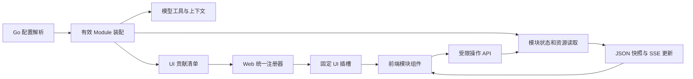

# Module UI 扩展调研与 JueX 方案建议

> [English](module-ui-research.md) | 中文

调研日期：2026-09-06。状态更新于 2026-09-08：固定插槽装配已通过 [PR #534](https://github.com/juex-ai/juex/pull/534) 实现。本文保留调研与原始建议，当前契约见 [DESIGN.md](../../DESIGN.zh.md) 和 [前端 README](../../frontend/README.zh.md)；下方缺口清单是历史记录。相关方案：[模块开关清单](module-switches.zh.md)、[极简模式审计](minimal-mode-audit.zh.md)。

建议采用 **Go 决定有效能力和 UI 贡献，Web 通过固定插槽装配功能组件**。配置只在 Go 解析一次；Web 消费装配结果，不重复实现 preset、默认值和开关优先级。功能仍分别有 Go 和 TypeScript 实现，但业务状态、权限和启用决策只有一个权威来源。

这比各页面读取配置更集中，也比运行时加载任意前端插件或用 Go 描述整棵 UI 树更适合当前三个内置功能。先完成 Goal、Notes、Scratchpad 的纵向模块化，后续再决定第三方 Extension 是否需要自带 UI。

**评论处理**

- 建议将 `file-tools` 改为 `basic-file-tools`，将 `search` 改为 `file-search`。Module ID 沿用现有的 `kebab-case`；配置字段名与工具名继续按各自契约命名。YAML 对 `_`、`-` 都支持，这里没有语法上的优劣。
- Shell 合并为 `shell` 模块，保留 `exec_command`、`write_stdin`、`list_shell_sessions`，不新增工具，也不改变原会话协议。
- 根据后续 Memory 回归决定，清单现为 18 个模块开关。未覆盖的 minimal 开启 basic-file-tools、shell、operating-context，共 6 个模型工具。

**调研范围与证据边界**

检查了本地源码，并打开官方在线文档核对公开设计。源码证据固定在以下本地提交；没有拉取或改动这些仓库，也没有运行三者的 UI、插件或测试。因此不把源码支持描述成所有发行客户端都支持。

| 项目 | 本地源码提交 | 本次重点 |
| --- | --- | --- |
| JueX | `2b0c1bbdc2e55741d680e858e79c635899bf9cf1` | Thread API、前端状态投影、Goal/Notes 状态入口、Scratchpad 面板 |
| Codex | `d1d51f6315f84a1737c655cb4d78104d030d5102` | app-server 的 MCP UI 能力声明、工具关联 UI 资源、来源绑定 |
| DeepSeek Harness | `0a53fb55bea101816fa226bb964ae2bed71c343b` | Host/Client 插件装配、Slots、Session projection、Goal UI |
| Pi | `05558a79280a2f1356bd390a573aeb28726d26b5` | TUI 扩展、工具结果渲染、RPC UI 协议及限制 |

**三种实现的区别**

| 项目 | UI 由谁实现 | 宿主提供的扩展面 | 状态与通信 | 对 JueX 的意义 |
| --- | --- | --- | --- | --- |
| Codex / MCP UI 路径 | 插件提供 HTML/JS 资源，支持该协议的客户端负责展示 | 工具关联的 UI 资源及 MCP Apps 能力协商；不是已证实的任意主界面插槽 | 工具结果、资源读取和 UI bridge；资源与调用来源关联 | 适合未来第三方交互卡片，不能直接替代常驻 Goal/Notes/Scratchpad 面板 |
| DeepSeek Harness | 浏览器插件中的 React 组件 | 有类型、作用域和释放语义的 Slot 注册；Host 输出实际 Client 装配图 | Host 权威状态 → 通用 projection/Remote → Client 模型 → UI | 最接近当前需求，值得借鉴状态贡献和插槽，完整动态加载器成本较高 |
| Pi | TypeScript 扩展中的终端组件；RPC 客户端自行实现支持的展示 | 工具/消息渲染器、widget、footer/header、custom TUI；RPC 只覆盖其中一部分 | Session 扩展状态、工具 details，以及 UI 请求/响应 | 适合借鉴轻量 UI 命令；完整 TUI 组件不能直接送到浏览器执行 |

**Codex：工具关联 UI 资源，客户端声明支持能力**

官方插件模型把 Skills、MCP tools 和可选 UI resources 放进一个包。UI 指南具体描述的是 ChatGPT 的 MCP Apps 实现：工具以 `_meta.ui.resourceUri` 关联 UI 资源，组件在 iframe 内运行，通过 `postMessage` 上的 JSON-RPC bridge 与宿主交互。业务后端提供数据/操作，UI 依然是 HTML/JavaScript，可以使用 React；不是后端语言直接绘制宿主界面。[插件架构](https://developers.openai.com/plugins/concepts/plugins)、[UI 指南](https://developers.openai.com/plugins/build/chatgpt-ui)。

Codex 本地 app-server 源码进一步证明了协议支持路径：客户端在初始化时声明 `io.modelcontextprotocol/ui` 及 MIME types；该能力随 Thread 会话传给下游 MCP。工具事件携带 `appContext.resourceUri`，`mcpServer/resource/read` 可用 `threadId` 和 `originCallId` 把资源读取绑定到原调用的 App/账户。见 [app-server 源码说明](https://github.com/openai/codex/blob/d1d51f6315f84a1737c655cb4d78104d030d5102/codex-rs/app-server/README.md#L87) 和 [来源恢复实现](https://github.com/openai/codex/blob/d1d51f6315f84a1737c655cb4d78104d030d5102/codex-rs/codex-mcp/src/resource_origin.rs#L100)。

官方 UI reference 区分模型可见的 `content` / `structuredContent` 与只提供给组件的结果 `_meta`。这是极简模式值得借鉴的边界：UI 展示所需数据不应默认变成模型上下文。[结果字段说明](https://developers.openai.com/plugins/reference#tool-results)。

证据没有建立“插件可以任意替换 Codex 的 Thread header、全局 sidebar 或 composer”的公开契约，也没有核验当前桌面客户端支持的每一种 bridge 方法。应把这条路线理解为工具关联 UI 协议，不据此承诺整个桌面布局可插件化。

**DeepSeek Harness：后端装配图 + 浏览器插件 + 状态投影 + Slots**

这是三者中最贴近 JueX Web 需求的一种，但它仍然明确分离 Host 业务实现和 Client UI 实现。

1. 插件包通过 `dsh.client` 声明浏览器入口，并导出构建后的 `./client`。Host 的 ClientModuleRegistry 扫描当前 Loader，跳过 disabled 或无活动 fiber 的条目，形成 `window.__DSH_BOOT__` 图，提供版本化 bundle 路由。浏览器按此图启动插件，不重新解析 Host YAML。[Client Modules](https://deepseek-harness.github.io/deepseek-harness/en/reference/subsystems/client-modules)；[源码过滤点](https://github.com/deepseek-ai/deepseek-harness/blob/0a53fb55bea101816fa226bb964ae2bed71c343b/packages/client/modules/src/index.ts#L902)。
2. UI 插件使用 `ctx.slots.register(...)` 注册 React 组件。Slot owner 声明可插入的位置，注册指定 ID、顺序和作用域；卸载会释放贡献并撤销其子插槽。其系统还支持 single/list/keyed/chain，JueX 首版不必照搬全部类型。[Slots](https://deepseek-harness.github.io/deepseek-harness/en/reference/subsystems/slots)。
3. Session 状态不是由每个页面重新读日志。业务模块注册命名 projection；框架根据已提交事件维护快照，并提供初始快照与变更推送。Client 接收完整投影值，UI 只消费对应 key。[Session projection 源码说明](https://github.com/deepseek-ai/deepseek-harness/blob/0a53fb55bea101816fa226bb964ae2bed71c343b/packages/session/session-projection/README.md)。
4. Goal 是现成例子：后端注册 `goalProjectionDefinition`；前端 `GoalDock` 通过 `useProjection('goal')` 取状态，通过注入的 `remote.goals` 回调发起操作，注册到 `conversation.input.dock`。Goal UI 不再维护独立的刷新链或业务事件折叠器。[Goal 后端](https://github.com/deepseek-ai/deepseek-harness/blob/0a53fb55bea101816fa226bb964ae2bed71c343b/packages/goal/goal/src/index.ts#L254)、[Goal UI 注册](https://github.com/deepseek-ai/deepseek-harness/blob/0a53fb55bea101816fa226bb964ae2bed71c343b/packages/client/ui-goal/src/client/index.ts#L81)。

关键借鉴是：功能实现可以跨两种运行环境，统一的是装配来源和契约。一个后端服务、一个 UI 包并不天然保证“一键关闭整个功能”；部署的组合仍需把它们绑定在同一功能单元下。JueX 应由自己的 Module 装配根明确完成这件事。

**Pi：同进程 TUI 很灵活，跨进程采用有限协议**

Pi 的扩展可以注册 `renderCall` / `renderResult`、消息渲染器、状态栏、编辑器上下方 widget，以及 `ctx.ui.custom()` 终端组件。组件与 Agent 在同一 Node 进程内，因而可以直接使用函数、主题和终端组件对象。扩展还可通过 `appendEntry` 保存 Session 私有状态，不必把每项功能放进核心 Session 专用字段。[扩展文档](https://github.com/earendil-works/pi/blob/main/packages/coding-agent/docs/extensions.md)。

RPC 模式暴露的是另一条边界：select/confirm/input/editor 等转换成 `extension_ui_request`，客户端返回同 ID 的 `extension_ui_response`；notify/setStatus 等是单向消息。源码中 `setWidget` 仅发送字符串数组，不发送组件工厂；`custom()` 返回 undefined，定制 footer/header 等为 no-op。[RPC 协议](https://github.com/earendil-works/pi/blob/main/packages/coding-agent/docs/rpc.md#extension-ui-protocol)、[RPC 适配源码](https://github.com/earendil-works/pi/blob/05558a79280a2f1356bd390a573aeb28726d26b5/packages/coding-agent/src/modes/rpc/rpc-mode.ts#L194)。

因此，不能把“Pi 插件可实现任意 TUI”推导为“它有同等自由度的远程 Web UI 插件”。跨语言、跨进程后，要么限定宿主可渲染的声明式组件，要么交付可在客户端运行的代码。

**JueX 目前实际耦合的位置**

| 位置 | 当前耦合 | 建议归属 |
| --- | --- | --- |
| [Thread 响应及读取](https://github.com/juex-ai/juex/blob/d962f4abc2d94993fd5846351357876c7ffbfe90/internal/web/handlers.go#L129) | 顶层 Goal/Notes 字段；非活动 Thread 路径直接按开关构造具体 Store | 通用 Thread 状态容器；具体读取交给模块的只读贡献者 |
| [前端事件投影](https://github.com/juex-ai/juex/blob/d962f4abc2d94993fd5846351357876c7ffbfe90/frontend/src/lib/thread-read-state.ts#L390) | 核心 reducer 识别 goal.updated / notes.updated 并更新专用字段 | 通用模块快照替换；具体业务状态由 Go 模块提供 |
| [ThreadStatusPanel](https://github.com/juex-ai/juex/blob/d962f4abc2d94993fd5846351357876c7ffbfe90/frontend/src/components/thread/ThreadStatusPanel.tsx#L35) | 总会挂载 Goal/Notes 合并入口；缺少值时仍能显示 goal idle | 固定状态区插槽；Goal/Notes 分别贡献，壳只管理布局 |
| [AppShell 文件面板](https://github.com/juex-ai/juex/blob/d962f4abc2d94993fd5846351357876c7ffbfe90/frontend/src/components/AppShell.tsx#L334) | Scratchpad 模式、切换按钮、请求及刷新 revision 写在总壳 | 文件区域注册点；Scratchpad 提供自己的根和加载器 |
| [Web 路由](https://github.com/juex-ai/juex/blob/d962f4abc2d94993fd5846351357876c7ffbfe90/internal/web/server.go#L214) / [文件读取](https://github.com/juex-ai/juex/blob/d962f4abc2d94993fd5846351357876c7ffbfe90/internal/web/files.go#L119) | 核心分派 scratchpad 子路径并理解具体根 | 模块拥有资源适配，Web 只提供作用域、鉴权和传输 |
| [Module 接口](https://github.com/juex-ai/juex/blob/d962f4abc2d94993fd5846351357876c7ffbfe90/internal/runtime/module/registry.go#L20) | 已有工具/上下文/策略生命周期，没有完整的 Web 贡献契约 | 新增窄的状态/资源与展示贡献边界，保持 Engine 不依赖 HTTP 或 React |

只把 Go 原始配置传给每个页面，无法消除上面的具体 Store、事件名和布局接线。只把这些状态改名放入 `map[string]any`，但仍在 Web 核心里 switch goal/notes，也没有完成解耦。

**建议的最小结构**



Go 侧由 App 根据同一有效 Module 集合装配运行能力和展示适配器。模块提供可展示状态、资源或操作；展示适配器提供稳定的 UI ID。Web adapter 负责 HTTP/SSE，Engine 无需知道具体 UI 或浏览器连接。配置不再经过前端二次决策，UI 数据也不自动进入 ContextProvider。

Web 侧先使用随 JueX 一起构建的功能包，例如 `frontend/src/modules/goal`、`notes`、`scratchpad`。只有统一装配层根据服务端贡献选择加载和注册；页面只渲染固定插槽，不包含 `if (config.modules.goal.enabled)`。组件可判断自身的加载、空值和错误状态，这与判断模块开关是两件事。

首版两个插入区域足够：Thread 状态区、文件面板的可选文件根。Goal/Notes 各自注册状态内容，可共享同一个容器而不互相导入；Scratchpad 提供文件根及加载器，复用已有文件树。暂不建设通用布局 DSL、任意脚本加载、热更新或第三方 React 依赖管理。

Go 只发布稳定贡献 ID 和协议版本；具体 slot、组件选择及排序由 Web 注册器拥有，避免两端重复维护布局映射。

示意协议如下，具体字段和路由仍需实现阶段收敛。这里的 `ui` 是已启用且当前 Thread 可用的贡献，不是原始配置；`module_state` 是只读投影，不是新增存储权威。

```json
{
  "thread_id": "0",
  "composition_revision": "opaque-runtime-revision",
  "ui": [
    {"id": "goal.status", "module": "goal", "version": 1}
  ],
  "module_state": {
    "goal": {"version": 1, "revision": 12, "status": "ready", "value": null}
  }
}
```

- 缺少 UI 贡献表示不挂载；`ready + null` 表示模块可用但尚无 Goal；读取失败单独表示 error。不能以“字段为 null”同时表达关闭、空值和故障。
- Goal/Notes 状态以 `module_id + version + revision + value` 命名；宿主只校验信封和分发，具体 schema 由模块拥有。Go/TS 的传输类型通过同源 schema 或生成声明保持一致，而不由核心维护每个业务类型。
- 初始快照与实时更新必须解决订阅竞争：捕获一致的 snapshot/cursor，或先订阅缓冲再读快照并按 revision 去重。重连替换完整基线，旧请求不能覆盖较新状态；不能仅增加事件监听器而遗漏初始状态与恢复。
- 当前 Thread、尚未启动的 Thread、归档 Thread 都应通过同一只读状态贡献查询；读取历史不能为了展示而启动 Engine、加载模型或创建 Scratchpad。归档只读限制由宿主执行。
- Scratchpad 文件树按需读取，不能把整棵树塞进每个 Thread 响应。模块关闭时不提供该文件根，也不注册它的专用读取/观察资源。
- 配置变更暂沿用重启 Agent；重连按新的 composition revision 清理失效组件、订阅和缓存。Fleet 切换 Agent/Thread 时以对应身份隔离状态，避免沿用上一个 Agent 的 UI 能力。
- 服务端每次操作仍检查当前模块注册、Thread 作用域和权限。隐藏按钮不能替代后端能力约束。Goal/Notes 的当前工作状态随模块关闭或移除删除，重新启用从空状态开始；Scratchpad 文件、配置和历史保留。旧工具结果可用通用历史视图展示，不重建已删除的当前状态。

## 工作状态的删除与保留

Goal/Notes 是有时效性的当前工作状态。模块被禁用或从有效组合移除时，删除其 `goal_state.json` / `notes.md`，重新开启从空状态开始。删除当前状态不改写已经持久化的对话和事件历史，也不从旧事件自动恢复这份状态。

| 生命周期事件 | Goal/Notes 当前状态 | Scratchpad、Memory 持久知识、用户配置和历史 |
| --- | --- | --- |
| 正常退出、重启，模块仍启用 | 保留，支持继续工作 | 保留 |
| 启用模块执行上下文重置 `/new` | 按该模块的重置语义清理 | 保留 |
| 模块禁用或移除的配置生效 | 删除；下次启用为空 | 保留 |
| 配置预览、校验失败、只读查询 | 不触发清理 | 保留 |

清理属于框架的资源生命周期。模块声明哪些私有状态可在移除时丢弃；资源建立时，框架记录 owner、Thread 内相对位置及保留策略。禁用模块不构造运行实例，框架仅根据这些通用归属记录清理文件，不解析 Goal/Notes 正文。归属信息独立于模块实例存在，因此实现代码不再参与装配时仍能清理，也不需要在核心维护模块名称分支。

配置通过校验并被确认应用后，先停止旧组合的相关写入，再执行移除清理，完成后发布新组合。没有运行实例的 Thread 也在清理范围内。清理是幂等操作：文件不存在即成功；失败保留待清理记录并报告，成功前不能认为移除完成，重新启用前也必须完成待清理工作。普通 Close、进程退出和失败的候选配置不代表功能移除。

这直接解决“创建 Goal → 禁用并生效 → /new → 再启用”的过期状态问题，无需为这条路径额外设计旧 Goal 的自动恢复规则。这里约定的是设计语义；本轮只更新文档。

**关于“全部由 Go 收敛”**

可以把启用决策、业务行为、可用操作和 UI 贡献集中在 Go；任意交互式浏览器 UI 仍需一个浏览器可执行的实现。Go 输出 HTML 需要处理交互和更新，Go 输出组件 JSON 需要 Web 实现组件解释器，Go 提供 JS bundle 则仍有前端代码。

当前推荐保留 Go + React 的各自职责，用同一 Module 身份关联它们。若以后要支持第三方插件带任意交互 UI，再比较两种更重的方案：类似 Codex 的隔离 iframe/bridge，或者类似 DeepSeek 的浏览器插件加载器。前者更适合独立交互卡片，后者更适合深度改变宿主界面；都超出本轮三个内置功能关闭的必要范围。

**实现后的验收重点**

1. Goal、Notes 独立关闭或同时关闭时，对应工具、上下文、状态读取、UI 入口和订阅均消失，另一模块正常工作；无残留 goal idle 占位；使禁用配置生效后，Goal/Notes 当前状态文件被清理，再开启不会复活旧状态。
2. Scratchpad 关闭后没有切换入口、文件树请求或专用 watcher，已打开面板回到 Workspace，磁盘旧文件保持不动。
3. 空状态、错误状态、初次加载、重连、切换 Agent/Thread 和归档只读都有明确行为，迟到响应不会恢复已禁用功能。
4. 新增一个测试用状态贡献不需要修改核心 Thread 业务字段、Go Web handler 或前端业务 reducer，只在装配根接入实现。核心仍负责信封、作用域和传输。
5. 模型请求测试继续证明未覆盖 minimal 的 6 个工具集合，且 UI 清单、文件树和仅展示字段不进入模型上下文。

本轮只修订方案和整理证据，没有实现 Module、API 或 UI 改造，也没有重新执行初始审计的运行时探针。
